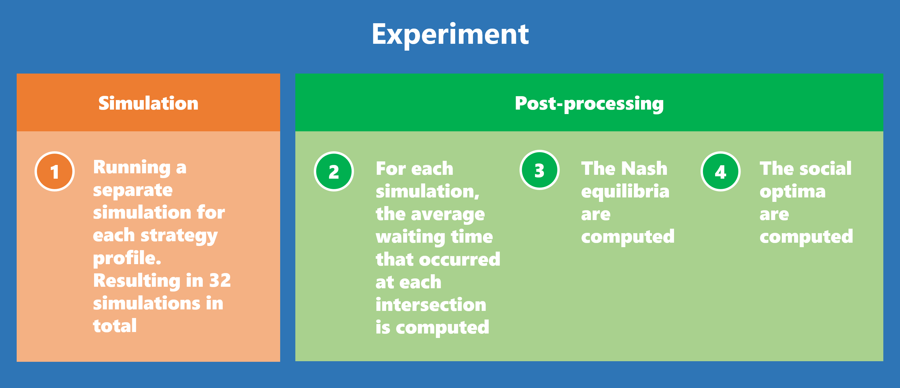

# Traffic Signal Control Strategies Experiment

This repository contains the code to automatically perform the simulations, compute the nash equilibria, and compute the social optima as described in the research paper "Using Game Theory to Analyse Local and Global Performance of Traffic Signal Control Strategies" by P.A. Tersmette.



## Table of Contents
- [Requirements](#requirements)
	- [Requirements for running it directly](#requirements-for-running-it-directly)
	- [Requirements for running it using Docker](#requirements-for-running-it-using-docker)
- [Usage](#usage)
	- [Running the experiment directly](#running-the-experiment-directly)
		- [Run simulation experiment](#run-simulation-experiment)
		- [Run individual simulation](#run-individual-simulation)
		- [Calculate average waiting times for individual simulation](#calculate-average-waiting-times-for-individual-simulation)
		- [Generate traffic based on stats file](#generate-traffic-based-on-stats-file)
	- [Running the experiment with Docker](#running-the-experiment-with-docker)
- [Contributing](#contributing)
- [License](#license)

## Requirements

The experiment can be run in two different ways, both with seperate requirements.

### Requirements for running it directly
- [SUMO 1.5.0+](https://sumo.dlr.de)
- [Python 3](https://www.python.org)

### Requirements for running it using Docker
- [Docker v19+](https://www.docker.com)

## Usage

### Running the experiment directly

#### Run simulation experiment

1. Open command line
2. Change the current working directory to the experiment folder
3. Run the following command: 
	```bash
	python experiment.py
	```

#### Run individual simulation

1. Open command line
2. Change the current working directory to the experiment folder
3. Run the following command with '{insert number}' replaced by the simulation number: 
	```bash
	sumo --configuration-file simulations\simulation_{insert number}\osm.sumocfg
	```

#### Calculate average waiting times for individual simulation

1. Open command line
2. Change the current working directory to the experiment folder
3. Run the following command with '{insert number}' replaced by the simulation number: 
	```bash
	python avg_waiting_time.py -d output\simulation_{insert number}_lane_data.xml -n simulations\simulation_{insert number}\osm.net.xml -s 0 -e 100000	
	```

#### Generate traffic based on stats file

1. Open command line
2. Change the current working directory to an individual simulation folder (e.g. simulation_0)
3. Run the following commands:
	```bash
	activitygen --net-file osm.net.xml --stat-file ..\..\configuration\routes\osm.stat.xml --output-file ..\..\configuration\routes\osm.trips.rou.xml --seed 26052020

	duarouter --net-file osm.net.xml --route-files ..\..\configuration\routes\osm.trips.rou.xml --output-file ..\..\configuration\routes\osm.rou.xml --ignore-errors
	```

### Running the experiment with Docker

1. Open command line
2. Change the current working directory to the project's root directory
3. Run the following command:
	```bash
	docker build .
	```

## Contributing

Pull requests are welcome. For major changes, please open an issue first to discuss what you would like to change.

## License
[GNU AGPLv3](https://choosealicense.com/licenses/agpl-3.0/)
